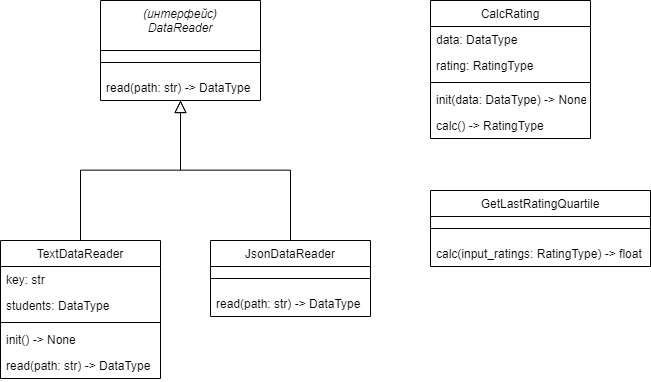

# Лабораторная 1 по дисциплине "Технологии программирования"

Это репозиторий для лабораторной №1 по технологиям программирования в ВолгГТУ.

Название лабораторной: "Знакомство с системой контроля версий Git и инструментом CI/CD Travis CI"

Цели работы:

1. Познакомиться c распределенной системой контроля версий кода Git и ее функциями;
2. Познакомиться с понятиями «непрерывная интеграция» (CI) и «непрерывное развертывание»
(CD), определить их место в современной разработке программного обеспечения;
3. Получить навыки разработки ООП-программ и написания модульных тестов к ним на
современных языках программирования;
4. Получить навыки работы с системой Git для хранения и управления версиями ПО;
5. Получить навыки управления автоматизированным тестированием программного обеспечения,
расположенного в системе Git, с помощью инструмента Travis CI.

Основные положения:

Дана программа на Python (см. методичку), читающая список студентов и рассчитывающая средний рейтинг студентов по дисциплинам. 
Нужно модифицировать её согласно персональному заданию. 
В процессе работы нужно использовать систему контроля версий Git и систему CI Travis (в данной работе также использовались Github Actions).

Постановка задачи:

1. Каждое задание делать в отдельной ветке и затем слить в основную;
2. Выбрать тип лицензии и добавить файл с лицензией в проект;
3. Добавить gitignore;
4. Добавить ещё один класс. Он должен наследоваться от DataReader и читать формат по заданию;
5. Добавить ещё один класс, выполняющий заданную расчётную процедуру;
6. Составить uml-диаграмму классов итогового проекта;
7. Проанализировать полученные результаты и сделать выводы.

Вариант: 2. Тип данных: JSON, расчётная процедура: вычислить и вывести на экран всех студентов, чей рейтинг попадает в последнюю квартиль распределения по рейтингам.

Используемые технологии: Python, Git, GitHub Actions, Travis CI.

UML-диаграмма классов:

Выводы: в ходе выполнения задания я ознакомился с Travis CI, GitHub Actions и типами лицензий, которые можно использовать для проекта.