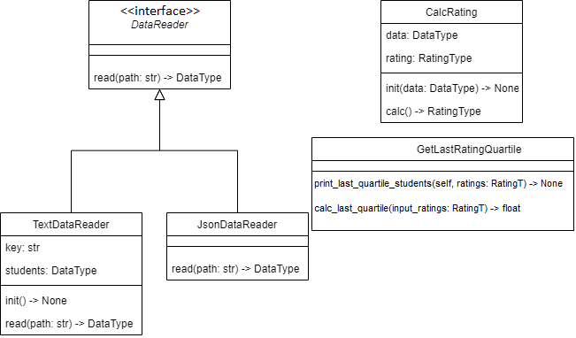

# Лабораторная 1 по дисциплине "Технологии программирования"

Это репозиторий для лабораторной №1 по технологиям программирования в ВолгГТУ.

Постановка задачи:

1. Каждое задание делать в отдельной ветке и затем слить в основную;
2. Выбрать тип лицензии и добавить файл с лицензией в проект;
3. Добавить gitignore;
4. Добавить ещё один класс. Он должен наследоваться от DataReader и читать формат по заданию;
5. Добавить ещё один класс, выполняющий заданную расчётную процедуру;
6. Составить uml-диаграмму классов итогового проекта;
7. Проанализировать полученные результаты и сделать выводы.

Вариант: 2. Тип данных: JSON, расчётная процедура: вычислить и вывести на экран всех студентов, чей рейтинг попадает в последнюю квартиль распределения по рейтингам.

Используемые технологии: Python

UML-диаграмма классов:

Выводы: в ходе выполнения задания я ознакомился с Travis CI, GitHub Actions и типами лицензий, которые можно использовать для проекта.